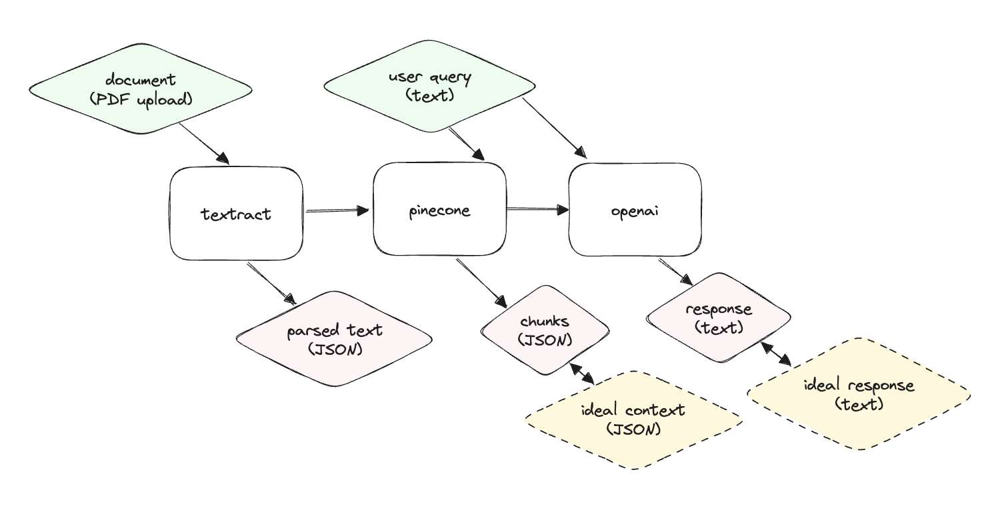

# Scorecard Python-demo

## Overview

This is a demo repo to show how end-to-end evaluation works with Scorecard.

This repo contains a mock system that is meant to resemble an AI system involving text extraction, a vector store (pinecone) and generation (via openai). A diagram of the mock system is shown below:




## Setup

### Install poetry

```bash
# Optional, if Python version is not 3.11:
poetry env use 3.11
# Install dependencies
poetry install
# Optional, use Poetry environment
poetry shell
```

### Add your environment variables

```bash
export OPENAI_API_KEY="<OPENAI_API_KEY>"

export PINECONE_API_KEY="<PINECONE_API_KEY>" # Optional. Only for Pinecone.
export PINECONE_ENVIRONMENT="<PINECONE_ENVIRONMENT>" # Optional. Only for Pinecone.
export INDEX_NAME="<INDEX_NAME>" # Optional. Only for Pinecone.
```

### Textract Setup

Run `aws configure` or your AWS credentials to `~/.aws/credentials` and `~/.aws/config` before running the code.

## Running the code

First, log into Scorecard and copy your API key:
https://app.getscorecard.ai/api-key

```bash
export SCORECARD_API_KEY="<SCORECARD_API_KEY>"
```

Then, programmatically create a Testset:
```python
poetry shell # If not already run above
python -m scripts.create_testset
```

You can view your newly created Testset at https://app.getscorecard.ai/dashboard.

Now, we can execute our mock system on this Testset using the run_eval script:

```python
poetry shell # If not already run above
python -m tests.run_eval
```

